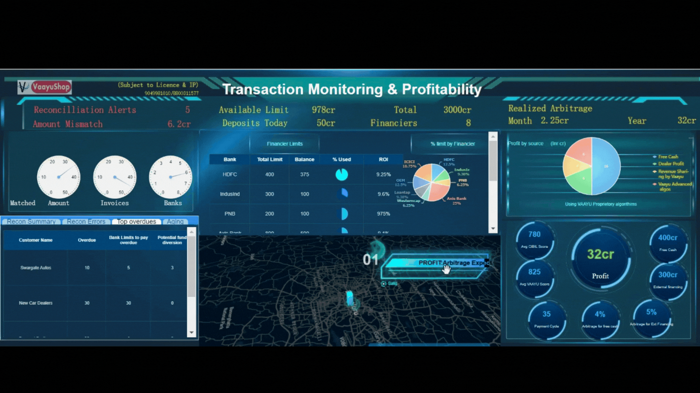
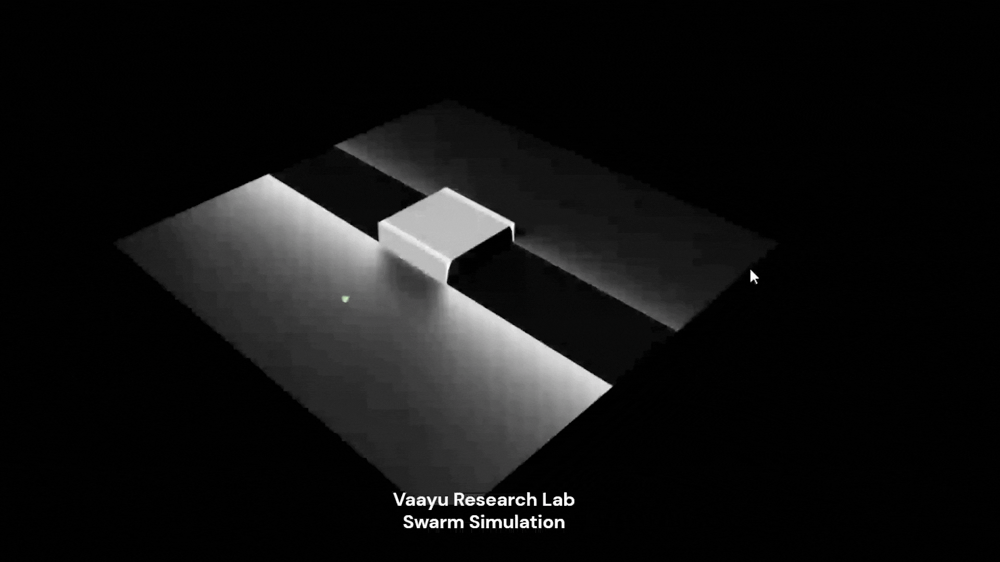
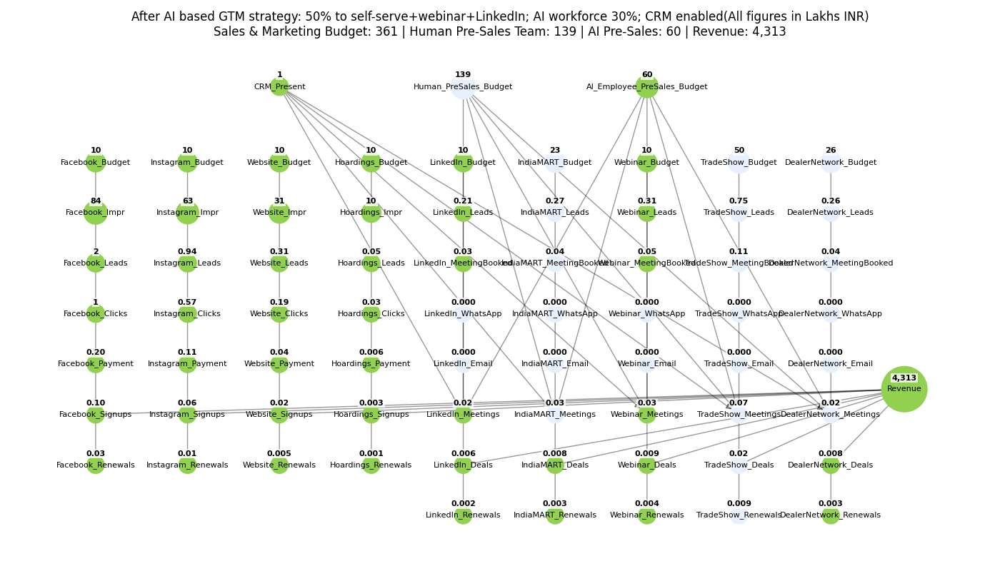
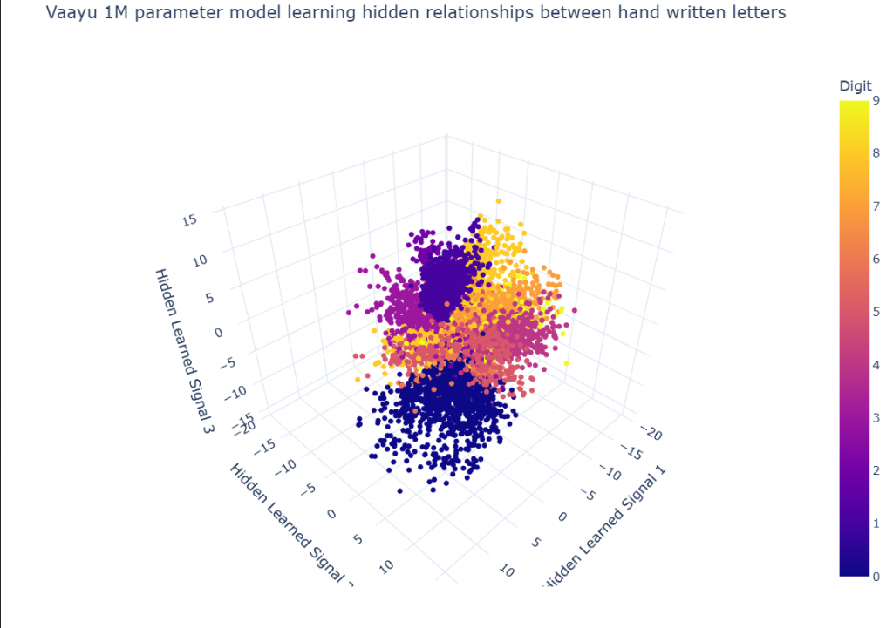

# Vaayu-EnterpriseWorldModels

# Vaayu Enterprise Decision Intelligence for Banking

One intelligence layer that perceives, predicts, reasons, decides, and learns.

[Try the Demo](#) · [Quickstart](#) · [Find Your Path](#) · [Architecture](#)

---

  
  
  
  

  <em>
    Enterprise World State · Prediction · Reasoning · Decision · Learning
  </em>

Open research infrastructure for Enterprise Decision & Financial Intelligence
powered by Vaayu World Models.

Signals -> Fuse -> Percieve -> Reason -> Compare outcomes of Decisions -> Decide -> Autonomous Actions -> Monitor & Feedback loop -> Self Improvement

---

## What is Enterprise Decision Intelligence? Byeond LLMs/SLMs

LLMs & SLMs make the decisions faster, not optimal
Context engineering, Knowledge graphs makes decisions complete, not optimal
World models attempt to make decisions optimal & self learn.

---

## Beyond Knowledge Graphs and Context Engineering

Data tells us what happened.
Knowledge graphs tell us what is connected.
Context engineering determines what an AI sees.

Enterprise Decision Intelligence asks:

How does the world evolve with new events happening?
What are the final objectives? Eg for a bank this may be maximize risk weighted returns.
What happens when a particular decision is taken?
What happens if we act?
What should we do, given multiple choices?
Did the decision work?

[Todo: Add architecture diagram]

---

## Training & Deployment
Systems are trained & deployed on premesis for Banks.
Data required is anonymized data used already by banks for their AI/ML based models.
In some cases if Data lake or Knoweldge graphs are present, those may be used.

## Architecture

[Todo: Add Detailed architecture diagram]

---

## Initial Research

### Swarm AI Defense

  

This is a simulator for core Swarm algo. The attackers are aware of only their sorroundings &
move with simple rules of not colliding & not going much away from herd. This leads to a systematic plan. The core algorithim can be adpated for Peneteration & offensive testing.

### Supply Chain Finance

  

System depicts how an automotive firm or OEM using Dealer finance can increase the profits by 2-8%.
This leverages Environmental & enterprise Perception - creating a world model, Reasoning & prediction.
Signals predict whether OEM should provide a credit line to a dealer or let them use the dealer financing offerred by the bank.

---

## Benchmarks

EnterpriseSwarmBench
SwarmFraudBench
SCF-WorldBench

---

## Research Areas

Perception • Data Fusion • Predictors • World Models • Reasoners
Optimiers • Metacognition • Decision Intelligence • Self-Improvement
• Financial Intelligence • Swarm AI • Emergence • Dynamic Systems under chaos
• Adaptive Reasoning

---

## Roadmap

Phase 1 → Foundations
Phase 2 → SCF
Phase 3 → Swarm Fraud
Phase 4 → Swarm Defense
Phase 5 → Self-Improving Decision Systems

---

## Contributing

...

## License

Apache 2.0